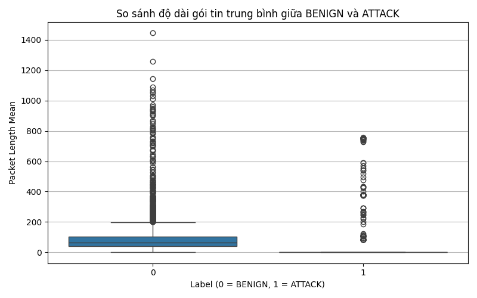
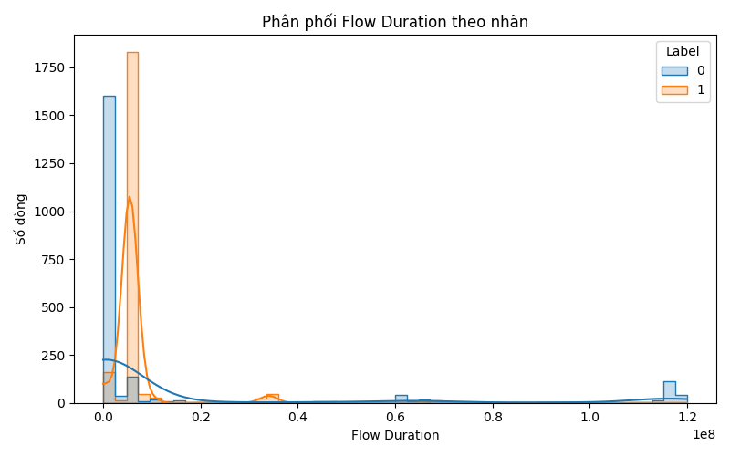
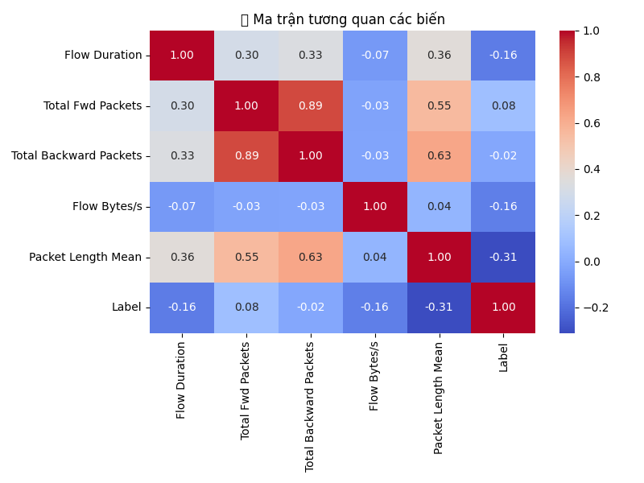
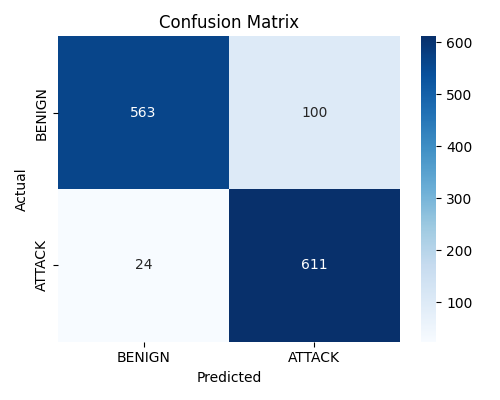
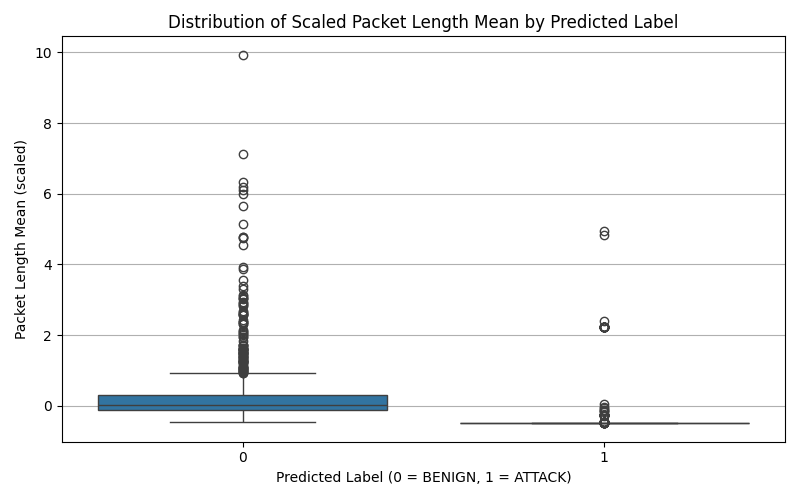

# 📊 Applied Statistics Project – Network Attack Detection (Thursday Dataset)

## 🎯 Objective
This project applies data cleaning, descriptive statistics, hypothesis testing, and logistic regression to analyze and detect cyber-attacks using flow-based features from network traffic logs.

---

## 📁 Dataset
- **Source file**: `Thursday_Cleaned_WebAttacks.csv` (~170,000 rows, 79 columns)
- After processing: `Thursday_Sampled_Balanced.csv` (4,326 rows – balanced binary classes)

Each record includes features such as `Flow Duration`, `Total Fwd/Backward Packets`, `Flow Bytes/s`, and `Label` (`BENIGN` or `ATTACK`).

---

## ✅ Steps Overview

### 🧼 Step 2 – Data Cleaning & Preprocessing
- Removed rows with `Destination Port = 0`
- Dropped rows with zero `Fwd` or `Bwd` packets
- Filled missing values with column means
- Encoded `Label`:  
  - `BENIGN` → 0  
  - Any attack label → 1
- Sampled 2,163 rows per class to balance the dataset

---

### 📊 Step 3 – Descriptive Statistics & Visualization

#### Boxplot – Comparison of Packet Length Mean (BENIGN vs ATTACK)
Shows significant difference in average packet length between normal and attack flows.

#### Histogram – Flow Duration Distribution by Label
Illustrates how attack flows are typically shorter than benign ones.

#### Correlation Heatmap
Visualizes correlation between selected numerical features and the attack label.

---

### 🧪 Step 4 – Hypothesis Testing
- **T-tests** confirm statistically significant differences between attack and benign groups for:
  - `Packet Length Mean`
  - `Flow Bytes/s`
- p-values < 0.001 → we reject the null hypothesis

---

### 📈 Step 5 – Logistic Regression

#### Confusion Matrix
Logistic regression achieved high accuracy after feature scaling.

- **Accuracy**: 90%
- **Precision (ATTACK)**: 86%
- **Recall (ATTACK)**: 96%
- **F1-score (Overall)**: 0.90

---

### 🧠 Step 6 – Evaluation & Presentation

#### Boxplot – Predicted Classes vs Scaled Packet Length Mean
Confirms that predicted attack flows have noticeably lower average packet size.

---
