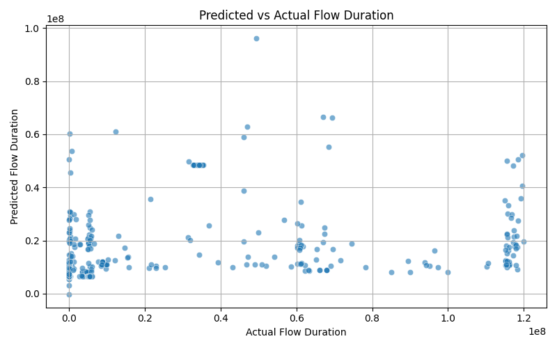
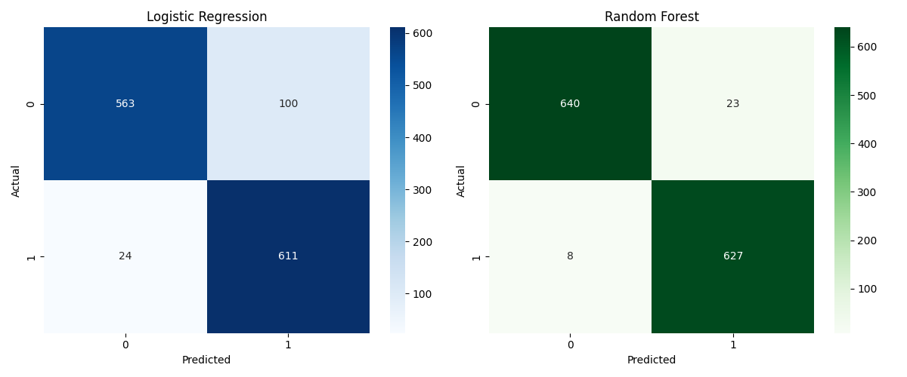

# 📊 Applied Statistics Project – Network Attack Detection (Thursday Dataset)

## 🎯 Objective
This project applies statistical techniques and regression models to analyze network flow data and detect potential cyber-attacks. Using a balanced subset of the Thursday dataset, we perform data cleaning, exploratory analysis, hypothesis testing, modeling, and evaluation.

---

## 📁 Dataset
- **Source**: `Thursday_Cleaned_WebAttacks.csv`
- **Final working file**: `Thursday_Sampled_Balanced.csv` (4,326 rows, balanced between BENIGN and ATTACK)

---

## ✅ Project Workflow

### 🧼 Step 2 – Data Cleaning
- Removed invalid ports (e.g., Destination Port = 0)
- Dropped rows with zero packets sent or received
- Filled missing values with column means
- Encoded labels: `BENIGN → 0`, all attacks → `1`
- Balanced the dataset with equal samples per class

---

### 📊 Step 3 – Descriptive Statistics

#### Packet Length Mean (BENIGN vs ATTACK)
Boxplot showing clear separation between benign and attack flows.

#### Flow Duration Histogram by Label
Attack flows are typically shorter and sharply peaked.

#### Feature Correlation Heatmap
Visualizes correlation between selected numeric features and label.

---

### 🧪 Step 4 – Hypothesis Testing

We performed independent T-tests on selected features:

| Feature            | T-statistic | P-value         | Conclusion                   |
|--------------------|-------------|------------------|------------------------------|
| Packet Length Mean | 21.51       | 7.3e-97          | ✅ Statistically significant |
| Flow Bytes/s       | 10.41       | 8.7e-25          | ✅ Statistically significant |

---

### 🔁 Step 5 – Logistic Regression

Logistic regression trained on scaled features.

#### Confusion Matrix

#### Classification Metrics
- Accuracy: **90%**
- Precision (ATTACK): **86%**
- Recall (ATTACK): **96%**
- F1-score (overall): **0.90**

---

### 📈 Step 6 – Evaluation & Visualization

#### Boxplot by Predicted Class
Packet Length Mean is lower for predicted attack flows.

---

## 🚀 Advanced Analysis

### 7️⃣ Step 7 – Linear Regression

We built a linear regression model to predict continuous `Flow Duration` from packet-based features.

> R² Score and Mean Squared Error were calculated to evaluate the fit.

---

### 8️⃣ Step 8 – Model Comparison

Comparison of **Logistic Regression vs Random Forest** using classification metrics and confusion matrices.

> Random Forest slightly outperformed logistic regression, capturing non-linear patterns.

---

### 9️⃣ Step 9 – Cross-Validation

We applied 5-fold stratified cross-validation to evaluate the stability and generalization of our logistic regression model.

- **Fold Accuracies**:  
  `[0.8891, 0.8948, 0.8948, 0.8971, 0.9156]`  
- **Mean Accuracy**: 0.8983  
- **Standard Deviation**: 0.0090

> Results show the model is consistent and generalizes well across folds.

---

### 🔟 Step 10 – Confidence Intervals

We computed 95% confidence intervals for logistic regression coefficients:

| Variable                 | Coef.     | CI Lower   | CI Upper   | P-value  |
|--------------------------|-----------|------------|------------|----------|
| Flow Duration            | -1.43     | -1.82      | -1.04      | < 0.001  |
| Total Fwd Packets        | +25.41    | +22.17     | +28.65     | < 0.001  |
| Total Backward Packets   | -23.29    | -26.65     | -19.92     | < 0.001  |
| Flow Bytes/s             | -3714.12  | -4517.59   | -2910.65   | < 0.001  |
| Packet Length Mean       | +0.28     | -0.18      | +0.74      | 0.234    |

> All variables except `Packet Length Mean` are statistically significant (CI does not include 0).

---

## 📂 Project Files

| File Name                         | Description |
|----------------------------------|-------------|
| `03_descriptive_stats.py`         | Summary stats and basic plots |
| `04_hypothesis_test.py`           | T-tests for key variables |
| `05_logistic_regression_clean.py` | Logistic regression with scaled features |
| `06_evaluate_present.py`          | Evaluation and boxplot visualization |
| `07_linear_regression_flow.py`    | Linear regression for `Flow Duration` |
| `08_model_comparison.py`          | Logistic vs Random Forest |
| `09_cross_validation.py`          | 5-fold cross-validation for stability |
| `10_confidence_interval.py`       | Confidence intervals for regression coefficients |
| `Thursday_Sampled_Balanced.csv`   | Cleaned, balanced dataset |
| `Figure_1.png` to `Figure_7.png`  | Visualizations for reporting |

---
